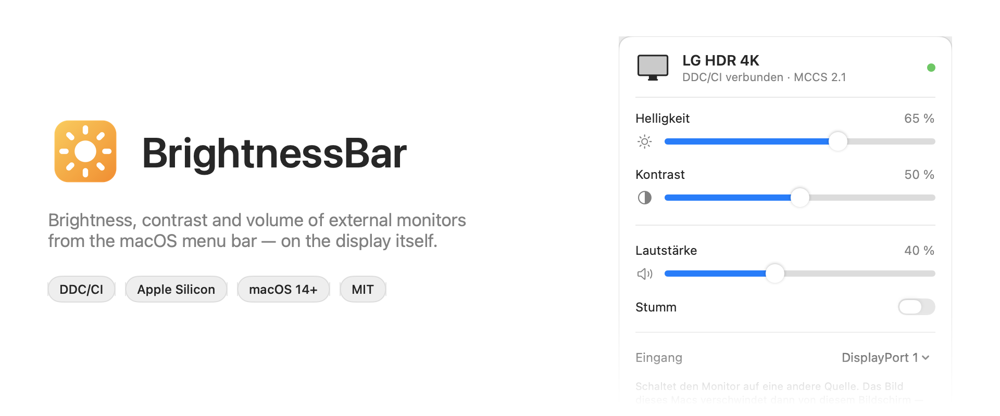
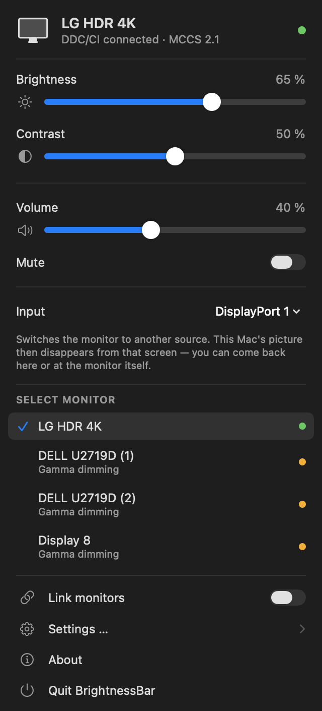
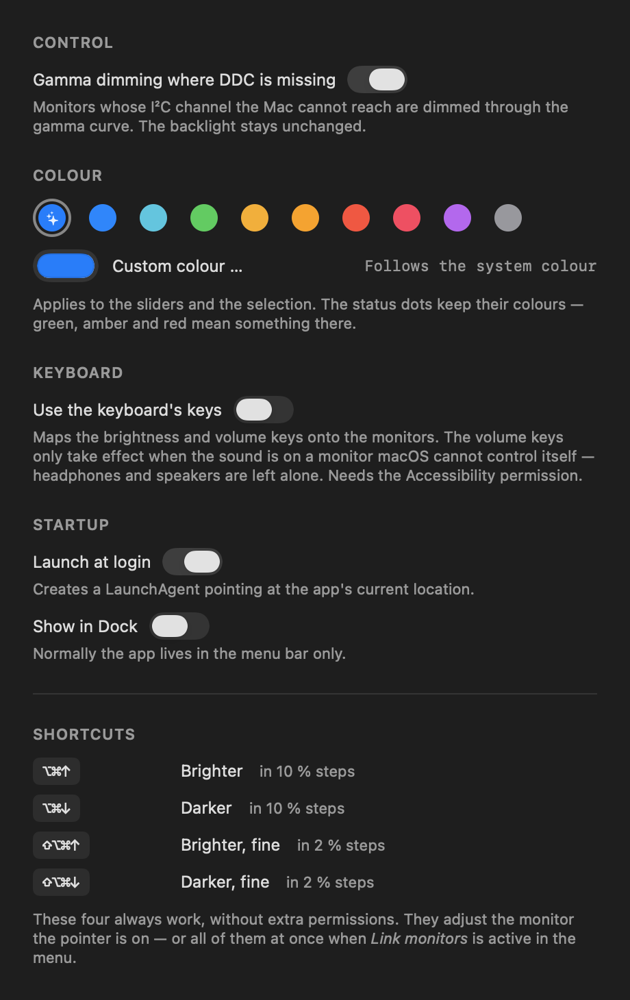

# BrightnessBar

*[Deutsche Fassung](README.de.md)*

Control the brightness of external monitors from the macOS menu bar — including the monitors
macOS gives you no slider for at all.

<picture>
  <source media="(prefers-color-scheme: dark)" srcset="docs/banner-en-dark.png">
  
</picture>

> **Language:** German and English, switchable under *Settings … → Language*. The default
> follows your system language.

## What this is for

macOS only adjusts brightness on built-in panels and on Apple's own displays. On an ordinary
external monitor the sliders in System Settings do nothing and the brightness keys are inert —
you have to reach for the monitor's own OSD menu.

BrightnessBar talks to the monitor directly over the I²C channel of its display connection
(DDC/CI) and sets the very same values the OSD does: brightness, contrast, volume.

## Features

* Brightness and contrast per monitor, on the backlight itself
* Volume and mute on monitors that have speakers
* Input switching where the monitor reports its sockets
* Global shortcuts that act on the monitor under the pointer
* Optionally the brightness and volume keys of the keyboard
* Link several monitors and adjust them together
* Gamma-based dimming as a fallback when the DDC channel is unreachable
* Launch at login, optional Dock icon, About window
* German and English interface, switchable in the settings
* Needs **no** Accessibility or Screen Recording permission for any of the above

## Installation

### Prebuilt app

The latest version is under [Releases](../../releases). Unpack it and drag it to
`/Applications`.

The app is ad-hoc signed, not notarized — an Apple Developer account costs €99 a year, which
is hard to justify for a small tool like this. Gatekeeper therefore blocks it on first launch.
Once:

**Right-click the app → Open → confirm "Open" in the dialog.**

Or on the command line:

```bash
xattr -dr com.apple.quarantine /Applications/BrightnessBar.app
```

### Building it yourself

Needs an Xcode toolchain (tested with Xcode 26.6 / Swift 6.3), but no Xcode project:

```bash
git clone https://github.com/Webdrian/BrightnessBar.git
cd BrightnessBar
./build.sh --install
```

`./build.sh` on its own builds into the project directory; `--install` also places the app in
`/Applications`. Built yourself, Gatekeeper never gets involved.

## Usage

Click the sun symbol in the menu bar to open the controls. The menu shows one monitor in
detail, and below it you can switch between the connected ones. The dot after each name says
how it is being driven — green means backlight over DDC/CI, amber means gamma dimming, red
means not controllable at all.

<p align="center">
  
  &nbsp;&nbsp;&nbsp;
  
</p>

Every switch, plus an explanation of the shortcuts, lives under *Settings …*.
The **slider colour** is configurable there as well — ten presets or a colour of your own; the
system accent colour is the default. The status dots stay as they are, because green, amber
and red carry meaning.

| Shortcut | Effect |
|---|---|
| `⌥⌘↑` / `⌥⌘↓` | brighter / darker, 10 % steps |
| `⇧⌥⌘↑` / `⇧⌥⌘↓` | brighter / darker, 2 % steps |

The shortcuts act on the monitor the pointer is currently on — with several screens, that is
the one you are working at. With *Link monitors* active they act on every
controllable monitor at once.

### The keyboard's own keys

The brightness and volume keys can be mapped onto the monitors — the *Use the keyboard's keys*
switch in the menu. They then adjust in sixteenths, the way macOS does on internal
displays, and the mute key mutes the monitor.

This is worth it above all for monitor speakers over DisplayPort or HDMI: such devices
frequently report no volume control to macOS at all, so the keys just show the crossed-out
speaker and do nothing. Over DDC it works anyway.

The volume keys only take effect **when the sound is actually going to a monitor**. If macOS
can set the current output device's volume itself — headphones, speakers, an audio interface —
the keys stay with macOS. If no monitor matches the output device unambiguously, the app
leaves them alone rather than adjusting the wrong device.

For this the app needs an exception under *System Settings → Privacy & Security →
Accessibility*, because key presses can only be intercepted through an event tap. The feature
is therefore **off by default** — everything else in this app runs without permissions. The
menu then shows whether the keys are actually active, and retries creating the tap every time
it opens, so a permission granted afterwards takes effect without a restart.

**An entry in that list does not mean it applies.** The permission is tied to the code
signature. With an ad-hoc signature the stored condition is "exactly this binary", and every
rebuild silently invalidates it — the entry stays visible and stops working. The fix is to run
`./Tools/make-signing-identity.sh` once (see below), or to remove the entry with "−" after
each update and add the app again.

### When a key does nothing at all

Not every keyboard sends its special keys through the macOS event system. On the development
machine (Logitech MX Keys Mac with Logi Options+), "brightness down" arrived reliably while
"brightness up" arrived **not once** — not intercepted, but never generated in the first
place. Vendor software sometimes executes such keys itself, below the level an event tap
works at. No app can do anything about that.

The way out leads through the vendor software itself: map the key to the keystroke `⌥⌘↑` or
`⌥⌘↓` there. It then generates that keystroke, and BrightnessBar picks it up as an ordinary
shortcut.

One more curiosity of the same keyboard turned up while measuring: it reports an
`NX_DEVICELCMDKEYMASK` bit with every media key, so macOS shows a Command key held down that
nobody touched. For media keys the app therefore evaluates only `⌥` and ignores the remaining
modifiers.

### Diagnostics

If you are unsure whether a key arrives at all:

```bash
defaults write de.webdrian.brightnessbar logMediaKeys -bool true
# restart the app, press keys, then:
cat ~/Library/Logs/BrightnessBar-diag.log
defaults write de.webdrian.brightnessbar logMediaKeys -bool false
```

What gets logged is media key codes and **only** the function keys F1–F12 — nothing from which
typed text could be reconstructed.

The same log records which language the interface resolved to at launch, which is the first
thing worth knowing when someone reports the wrong one.

Holding `⌥` passes the keys through to macOS, so `⌥` + volume still opens the sound settings.

*Launch at login* creates a LaunchAgent at
`~/Library/LaunchAgents/de.webdrian.brightnessbar.agent.plist`. It stores the absolute path to
the app: move the app to its final location first, then switch this on.

## Switching inputs

If a monitor reports input selection (VCP `0x60`) along with the list of its sockets, a picker
appears in the menu — to switch between a Mac and a games console, say, without reaching for
the OSD wheel. The list comes from the device itself; nothing is guessed, because a wrong
input turns the screen black.

The app asks before switching, and for a measured reason: **many monitors serve DDC only for
the input they are currently showing.** On the test machine (LG UN880) the way to the console
is one click, but the way back only through the monitor's own menu — once HDMI is active the
Mac can no longer reach the device, even though the cable stays connected and macOS still
lists the monitor.

After switching, the app reads back the actual input instead of assuming success. If the
monitor stayed where it was, it says so rather than displaying something untrue.

That is not theoretical caution. The test device lists `60(11 12 0F 10)` in its capability
string and **discards writes to it anyway**: with a signal present on the target socket, with
a subsequent `Save Current Settings` (0x0C), on a perfectly working channel, while brightness
worked in the same breath. This is common with that vendor. A reported capability is a claim
by the device, not a promise — which is why the app measures instead of believing.

## How a monitor is recognised

None of this is tailored to a particular device. The app finds displays generically through
CoreGraphics and matches them via the EDID data in the IORegistry; DDC/CI is a VESA standard
and the VCP codes used are the standard ones. Maximum values are **read from** the monitor
rather than assumed — a device working internally on a 0–255 scale is handled correctly as a
result.

Beyond that, the app asks the monitor **what it can do**: VCP `0xF3` returns a capability
string describing which features it implements.

```
(prot(monitor)type(lcd)model(UN880)cmds(01 02 03 0C E3 F3)
 vcp(02 04 05 08 10 12 14(05 08 0B) 16 18 1A 52 60(11 12 0F 10) … 62 8D …)
 mccs_ver(2.1))
```

Sliders then appear for exactly the reported features instead of a hard-wired list. If a
monitor reports a feature but refuses to report its value, the slider is offered anyway — one
that might work beats none at all. If a device does not answer `0xF3`, the app falls back to
probing each code directly.

The timing is not fixed either: monitors differ by more than an order of magnitude in how long
they take to answer. Instead of one hand-tuned constant the app climbs a ladder from 40 to
320 ms until the device replies, and remembers the step. Capability string and timing are
cached per monitor by EDID identity rather than by display ID, which changes between reboots —
first contact took 2.0 s in testing, every later one 0.7 s.

**Apple Silicon is a requirement.** The `IOAVService` route used here does not exist on Intel
Macs; there DDC would go through `IOFramebuffer`/`IOI2C`, which is not implemented.

## Which monitors work

The app distinguishes three cases, because they need very different handling.

1. **Answers reads and writes.** Normal operation, the backlight is being driven.
2. **Does not answer reads but accepts commands.** The slider is shown and marked with "?";
   many devices refuse only *Get*, not *Set*.
3. **The I²C channel is not reachable at all.** `IOAVServiceWriteI2C` fails at the sending
   stage. A slider claiming to drive the backlight would be a lie here, so the app switches to
   gamma dimming and writes that into the row.

Case 3 is almost always about the path between Mac and monitor, not the monitor. On the
development machine it affects two of three displays, and the IORegistry names the cause
unambiguously: both sit behind a DisplayPort branch device, the working one does not.

| Monitor | Branch device in the path | DDC |
|---|---|---|
| LG HDR 4K, straight into USB-C/DP | none | works |
| DELL U2719D | `pHDMIg` — DP→HDMI converter | refused |
| DELL U2719D | `Dp1.2` — DP branch | refused |

Measured with 27 parameter variations per monitor (one to three sends, 40/150/400 ms wait, VCP
`0x10`, `0xDF`, `0x60`): a valid answer every time on the LG, and on both Dells error
`0xE0114000` at the write stage every time, plus a reply buffer of nothing but zeros. Timing,
protocol and parameters are therefore ruled out as the cause.

What helps:

* **A connection without a protocol converter** — USB-C (DP Alt Mode) to DisplayPort. Adapters
  with a converter chip, DP hubs, MST splitters and KVM switches mostly do not carry the I²C
  channel.
* **Enabling DDC/CI in the OSD menu.** On the U2719D under *Menu → Others → DDC/CI*. That
  alone is not enough if the path itself does not carry the channel.

## Signature and permissions

macOS ties the Accessibility permission to the code signature. With ad-hoc signing that is the
hash of the binary itself — so every rebuild invalidates the permission without any visible
sign. A self-signed certificate, created once, solves this:

```bash
./Tools/make-signing-identity.sh
tccutil reset Accessibility de.webdrian.brightnessbar
./build.sh --install
```

The stored condition then reads `identifier "de.webdrian.brightnessbar" and certificate
root = H"…"` instead of a binary hash, and the permission survives every rebuild. `build.sh`
finds the certificate on its own and falls back to ad-hoc without it.

Gatekeeper does **not** get better from this — that needs a Developer ID and notarization.
Only the permission becomes stable.

To remove it again:

```bash
security delete-identity -c "BrightnessBar Self-Signed"
```

## Gamma dimming

For monitors in case 3 the app scales the display's transfer function
(`CGSetDisplayTransferByFormula`) instead of driving the backlight. This is explicitly not the
same thing:

* The backlight keeps burning at full power — nothing is saved.
* Very dark settings cost colour resolution.
* 0 % corresponds to a factor of 0.15, not black. A display you can no longer see is a display
  you can no longer set back.

The *Gamma dimming where DDC is missing* switch is on by default, because the affected monitors
would otherwise not be adjustable at all. Switched off, the app restores every gamma table and
lists those displays as not controllable.

A gamma table outlives the process that set it, so the app cleans up on quit. After waking or
a display reconfiguration it sets the value again, because macOS discards the table then.

## Layout

| File | Contents |
|---|---|
| `Sources/DDC.swift` | DDC/CI over `IOAVService`: packet format, checksums, timing, coalescing |
| `Sources/DisplayRegistry.swift` | matches CoreGraphics displays to I²C channels via EDID and DCP instance |
| `Sources/Capabilities.swift` | reads and interprets the monitor's capability string, plus cache |
| `Sources/DisplayController.swift` | display model, probing, hotplug and wake handling |
| `Sources/SoftwareDimming.swift` | gamma fallback for displays with no reachable DDC channel |
| `Sources/BuiltInBrightness.swift` | `DisplayServices` path for internal and Apple displays |
| `Sources/AudioOutput.swift` | which device the sound is going to, and whether macOS can set its volume |
| `Sources/Hotkeys.swift` | global shortcuts (Carbon), LaunchAgent |
| `Sources/MediaKeys.swift` | event tap for the keyboard's media keys |
| `Sources/MenuUI.swift` | SwiftUI menu, monitor picker, hand-drawn slider |
| `Sources/SettingsWindow.swift` | settings window including the shortcut reference |
| `Sources/AboutWindow.swift` | About window and app metadata |
| `Sources/Appearance.swift` | selectable accent colour, kept apart from the status colours |
| `Sources/DockVisibility.swift` | turning the Dock icon on and off |
| `Sources/App.swift` | `MenuBarExtra` entry point, main menu |
| `Tools/make-icon.sh` | generates `Resources/AppIcon.icns` from code |
| `Tools/make-signing-identity.sh` | creates the self-signed certificate for stable permissions |

## Technical notes

Apple Silicon has no public I²C interface for external displays. The route goes through
`IOAVServiceCreateWithService`, `IOAVServiceWriteI2C` and `IOAVServiceReadI2C` in IOKit —
undocumented and declared in no header, so the symbols are resolved at runtime via `dlsym`. If
they are missing, the app reports the displays as not controllable rather than crashing.

Matching monitor to I²C channel runs through the IORegistry: the framebuffer node (`disp0`,
`dispext0`, …) carries the EDID data, by which it is matched unambiguously to a
`CGDirectDisplayID` via vendor, product and serial number. The corresponding
`DCPAVServiceProxy` hangs under the matching DCP instance (`dcp` → `disp0`,
`dcpext0` → `dispext0`).

Two quirks that showed up while measuring and are accounted for in the code:

1. **A read request has to be sent twice.** With a single request the monitor under test
   returned an unchanged stale copy of its buffer every time; with two it answered reliably —
   4 valid answers out of 4 instead of 0 out of 6.
2. **`IOAVServiceReadI2C` overwrites byte 1 of the reply** — the length byte `0x88` — with the
   I²C offset it read from. It is put back before the checksum is verified; the checksum is
   formed with seed `0x50` over the reply.

The same quirk complicates reading the capability string, where the length is not a known
constant. There it is recovered through the checksum, which validates the reply at the same
time.

Writes are coalesced: while a slider is being dragged only the newest value goes onto the bus,
so the I²C channel does not overflow. 31 slider updates in 0.38 s landed on the correct final
value in testing.

Probing distinguishes "monitor is silent" from "channel unavailable" (`DDCProbeResult`). Only
the second case leads to gamma dimming, and it is not retried — retries cannot change it.

## Tested on

Mac Studio M4 Max, macOS 26.5, Xcode 26.6. LG HDR 4K over DisplayPort: reading and writing
brightness, contrast, volume and mute all work, and a value once set stays put. Two DELL
U2719D behind converters: not reachable over DDC, running on gamma dimming.

Shortcuts and media keys are confirmed on real hardware: `⌥⌘↑`/`⌥⌘↓` fire and are handled,
volume and mute work from the keyboard. Switching the interface language from the settings
window and back is confirmed too. The brightness keys depend on the keyboard — see "When
a key does nothing at all".

The `DisplayServices` path for internal panels is implemented but **untested** — a Mac Studio
has no internal display.

Three monitors behaved in three different ways here. That is the best warning there is against
concluding from one device to all of them. If you try it on other hardware, an issue reporting
what worked and what did not is genuinely useful.

## Author

© 2026 Webdrian — [webdrian.de](https://webdrian.de)

## License

MIT — see [LICENSE](LICENSE).
