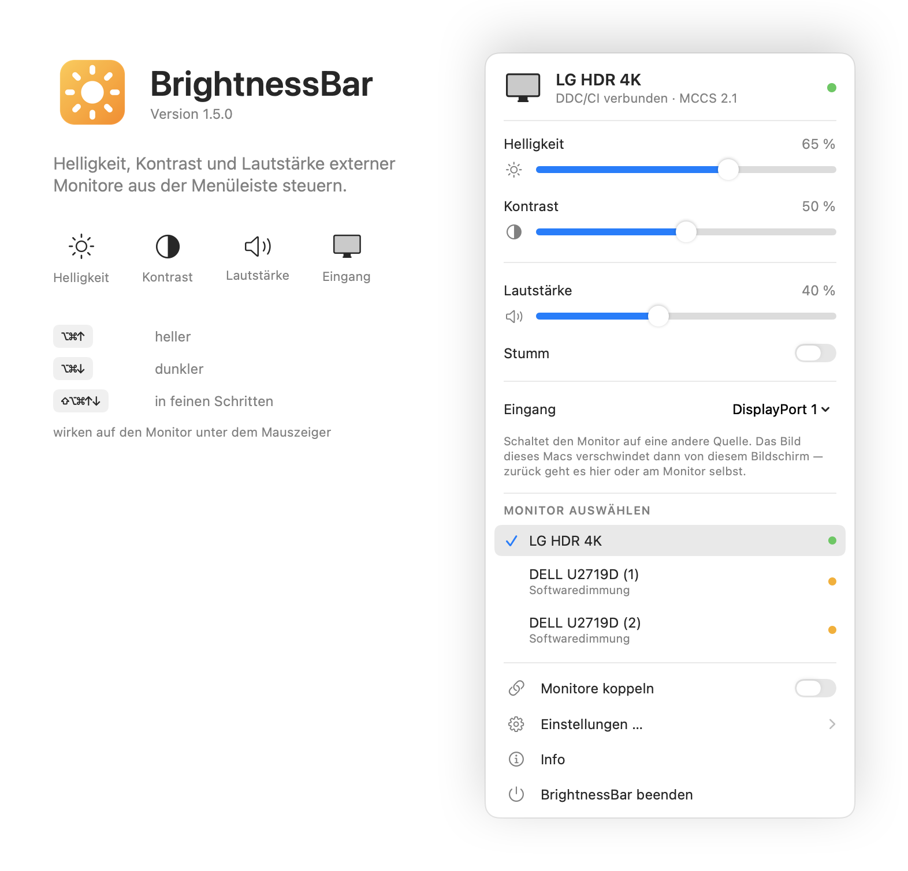
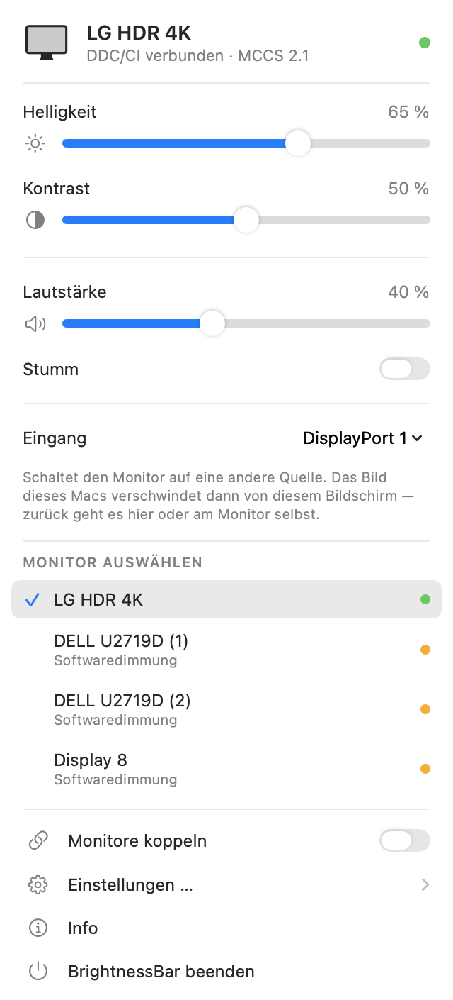
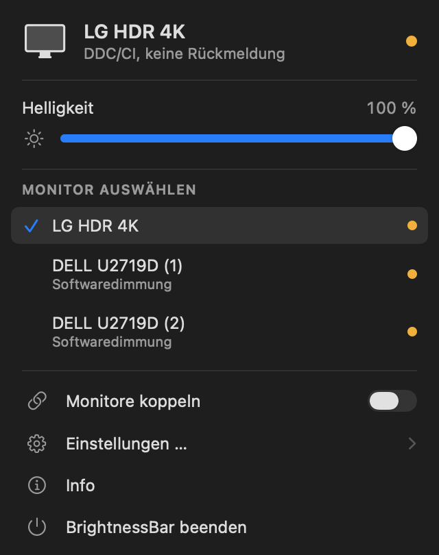
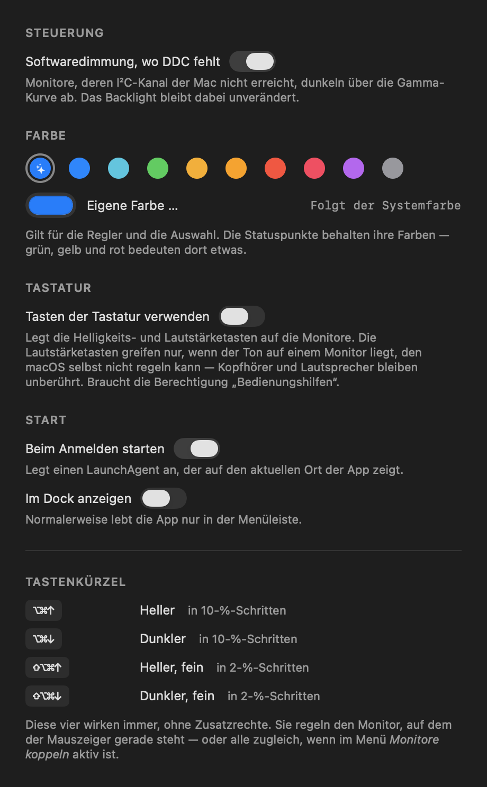

# BrightnessBar

Helligkeit externer Monitore aus der Menüleiste steuern — auch die Monitore, für die macOS
gar keinen Regler anbietet.

> *English: a macOS menu bar app to control external monitor brightness, contrast and speaker
> volume over DDC/CI on Apple Silicon, with a gamma-based dimming fallback for displays whose
> I²C channel is unreachable. UI is in German.*

<p align="center">
  
</p>

<p align="center">
  
  &nbsp;&nbsp;
  
  &nbsp;&nbsp;
  
</p>

## Worum es geht

macOS regelt die Helligkeit nur bei internen Panels und bei Apples eigenen
Thunderbolt-Displays. Bei einem gewöhnlichen externen Monitor sind die Schieber in den
Systemeinstellungen wirkungslos und die Helligkeitstasten tun nichts — man muss ans
OSD-Menü des Geräts.

BrightnessBar spricht den Monitor direkt über den I²C-Kanal seines Displayanschlusses an
(DDC/CI) und regelt dort dieselben Werte, die das OSD-Menü setzt: Helligkeit, Kontrast,
Lautstärke.

## Funktionen

* Helligkeit und Kontrast pro Monitor, direkt am Backlight
* Eingang umschalten, wenn der Monitor seine Buchsen meldet
* Lautstärke und Stummschaltung bei Monitoren mit Lautsprechern
* Globale Tastenkürzel, die auf den Monitor unter dem Mauszeiger wirken
* Optional die Helligkeits- und Lautstärketasten der Tastatur
* Mehrere Monitore koppeln und gemeinsam regeln
* Softwaredimmung als Fallback, wenn der DDC-Kanal nicht erreichbar ist
* Anmeldestart, optionales Dock-Symbol, Info-Fenster
* Braucht **keine** Bedienungshilfen- oder Bildschirmaufnahme-Rechte

## Installation

### Fertige App

Die neueste Version liegt unter [Releases](../../releases). Nach dem Entpacken nach
`/Applications` ziehen.

Die App ist nur ad-hoc signiert, nicht notarisiert — ein Apple-Developer-Account kostet
99 €/Jahr, und das ist für ein kleines Werkzeug wie dieses schwer zu rechtfertigen.
Gatekeeper blockiert sie deshalb beim ersten Start. Einmalig:

**Rechtsklick auf die App → Öffnen → im Dialog „Öffnen" bestätigen.**

Alternativ auf der Kommandozeile:

```bash
xattr -dr com.apple.quarantine /Applications/BrightnessBar.app
```

### Selbst bauen

Braucht eine Xcode-Toolchain (getestet mit Xcode 26.6 / Swift 6.3), aber kein
Xcode-Projekt:

```bash
git clone https://github.com/Webdrian/BrightnessBar.git
cd BrightnessBar
./build.sh --install
```

`./build.sh` allein baut nur ins Projektverzeichnis, `--install` legt die App zusätzlich
nach `/Applications`. Selbst gebaut greift Gatekeeper gar nicht ein.

## Benutzung

Klick auf das Sonnensymbol in der Menüleiste öffnet die Regler. Das Menü zeigt einen Monitor
im Detail; darunter lässt sich zwischen den angeschlossenen wechseln. Der Punkt hinter jedem
Namen sagt, wie er angesteuert wird — grün heißt Backlight über DDC/CI, gelb heißt
Softwaredimmung, rot heißt gar nicht steuerbar.

Alle Schalter und eine Erklärung der Tastenkürzel stehen unter *Einstellungen …*. Dort lässt
sich auch die **Farbe der Regler** wählen — zehn Vorgaben oder eine eigene; voreingestellt
ist die Akzentfarbe des Systems. Die Statuspunkte bleiben davon unberührt, weil grün, gelb
und rot dort eine Bedeutung tragen.

| Kürzel | Wirkung |
|---|---|
| `⌥⌘↑` / `⌥⌘↓` | heller / dunkler, 10-%-Schritte |
| `⇧⌥⌘↑` / `⇧⌥⌘↓` | heller / dunkler, 2-%-Schritte |

Die Kürzel wirken auf den Monitor, auf dem der Mauszeiger gerade steht — bei mehreren
Bildschirmen also auf den, an dem man arbeitet. Ist *Alle Displays koppeln* aktiv, wirken
sie auf alle steuerbaren Monitore gleichzeitig.

### Tasten der Tastatur

Die Helligkeits- und Lautstärketasten der Tastatur lassen sich auf die Monitore legen —
Schalter *Tasten der Tastatur verwenden* im Menü. Sie regeln dann in Sechzehntel-Schritten,
so wie macOS es bei internen Displays tut, und die Stummschalttaste schaltet den Monitorton.

Das lohnt besonders bei Monitorlautsprechern über DisplayPort oder HDMI: solche Geräte
melden macOS oft überhaupt keine Lautstärkeregelung — dann zeigen die Tasten nur das
durchgestrichene Lautsprechersymbol und tun nichts. Über DDC funktioniert es trotzdem.

Die Lautstärketasten greifen dabei **nur, wenn der Ton auch wirklich zum Monitor geht**. Kann
macOS das aktuelle Ausgabegerät selbst regeln — Kopfhörer, Lautsprecher, Audiointerface —
bleiben die Tasten bei macOS. Passt kein Monitor eindeutig zum Ausgabegerät, lässt die App
sie ebenfalls in Ruhe, statt am falschen Gerät zu drehen.

Dafür braucht die App eine Ausnahme unter *Systemeinstellungen → Datenschutz & Sicherheit →
Bedienungshilfen*, weil Tastendrücke nur über einen Event-Tap abzufangen sind. Deshalb ist
die Funktion **standardmäßig aus** — alles andere in dieser App läuft ohne Berechtigungen.
Das Menü zeigt danach an, ob die Tasten tatsächlich aktiv sind, und versucht bei jedem
Öffnen erneut, den Tap zu erzeugen — eine nachträglich erteilte Berechtigung greift also
ohne Neustart.

**Ein vorhandener Eintrag in der Liste bedeutet nicht, dass er gilt.** Die Berechtigung hängt
an der Code-Signatur. Ist die App nur ad-hoc signiert, lautet die hinterlegte Bedingung
„genau dieses Binary", und jeder Neubau macht sie still ungültig — der Eintrag bleibt sichtbar
stehen und wirkt trotzdem nicht. Abhilfe: `./Tools/make-signing-identity.sh` einmal ausführen
(siehe unten), oder nach jedem Update den Eintrag mit „−" entfernen und neu hinzufügen.

### Wenn eine Taste gar nichts auslöst

Nicht jede Tastatur schickt ihre Sondertasten durch macOS' Ereignissystem. Auf dem
Entwicklungsrechner (Logitech MX Keys Mac mit Logi Options+) kam „Helligkeit dunkler"
zuverlässig an, „Helligkeit heller" dagegen **kein einziges Mal** — nicht abgefangen,
sondern gar nicht erst erzeugt. Die Herstellersoftware führt solche Tasten teils selbst aus,
unterhalb der Ebene, auf der ein Event-Tap arbeitet. Dagegen kann keine App etwas
ausrichten.

Der Ausweg führt über die Herstellersoftware selbst: dort die Taste auf den Tastenanschlag
`⌥⌘↑` bzw. `⌥⌘↓` legen. Den erzeugt sie dann selbst, und BrightnessBar greift ihn als
normalen Kurzbefehl ab.

Beim Nachmessen fiel noch eine Kuriosität derselben Tastatur auf: sie meldet zu jeder
Medientaste ein `NX_DEVICELCMDKEYMASK`-Bit mit, wodurch macOS eine gedrückte Command-Taste
anzeigt, die niemand berührt hat. Die App wertet für Medientasten deshalb nur `⌥` aus und
ignoriert die übrigen Modifier.

### Diagnose

Bei Zweifeln, ob eine Taste überhaupt ankommt:

```bash
defaults write de.webdrian.brightnessbar logMediaKeys -bool true
# App neu starten, Tasten drücken, dann:
cat ~/Library/Logs/BrightnessBar-diag.log
defaults write de.webdrian.brightnessbar logMediaKeys -bool false
```

Protokolliert werden Medientasten-Codes und **ausschließlich** die Funktionstasten F1-F12 —
nichts, woraus sich Getipptes rekonstruieren ließe.

Mit gehaltenem `⌥` gibt die App die Tasten an macOS durch, damit `⌥` + Lautstärke weiterhin
die Toneinstellungen öffnet.

*Beim Anmelden starten* legt einen LaunchAgent unter
`~/Library/LaunchAgents/de.webdrian.brightnessbar.agent.plist` an. Der speichert den
absoluten Pfad zur App: erst an den endgültigen Ort verschieben, dann aktivieren.

## Eingang umschalten

Meldet ein Monitor in seiner Selbstauskunft die Eingangswahl (VCP `0x60`) samt der Liste
seiner Buchsen, erscheint im Menü eine Auswahl — etwa um zwischen Mac und Spielkonsole zu
wechseln, ohne ans OSD-Rad zu greifen. Die Liste kommt vom Gerät selbst; geraten wird nichts,
denn ein falscher Eingang macht den Bildschirm schwarz.

Vor dem Umschalten fragt die App nach, und das aus einem gemessenen Grund: **viele Monitore
bedienen DDC nur für den gerade aktiven Eingang.** Auf dem Testgerät (LG UN880) ist der Weg
zur Konsole ein Klick, der Weg zurück aber nur über das Monitormenü — sobald HDMI aktiv ist,
erreicht der Mac das Gerät nicht mehr, obwohl die Kabelverbindung bestehen bleibt und macOS
den Monitor weiter als angeschlossen führt.

Nach dem Umschalten liest die App den tatsächlichen Eingang zurück, statt den Erfolg
anzunehmen. Bleibt der Monitor stehen, sagt sie das, anstatt etwas Falsches anzuzeigen.

Das ist keine theoretische Vorsicht. Das Testgerät — ein LG UN880 — führt `60(11 12 0F 10)`
in seiner Selbstauskunft und **verwirft Schreibzugriffe darauf trotzdem**: mit anliegendem
Signal an der Zielbuchse, mit anschließendem `Save Current Settings` (0x0C), bei
einwandfreiem Kanal, während Helligkeit im selben Moment funktionierte. Bei diesem Hersteller
ist das verbreitet. Eine gemeldete Fähigkeit ist eben eine Behauptung des Geräts, kein
Versprechen — deshalb wird nachgemessen statt geglaubt.

## Wie ein Monitor erkannt wird

Nichts davon ist auf ein bestimmtes Gerät zugeschnitten. Die App findet Displays generisch
über CoreGraphics und ordnet sie über die EDID-Daten der IORegistry zu; DDC/CI ist ein
VESA-Standard, und die verwendeten VCP-Codes sind die Standardcodes. Maximalwerte werden vom
Monitor **gelesen**, nicht angenommen — ein Gerät, das intern mit 0-255 arbeitet, wird
dadurch richtig behandelt.

Darüber hinaus fragt die App den Monitor, **was er kann**: VCP `0xF3` liefert eine
Selbstauskunft, aus der hervorgeht, welche Funktionen er implementiert.

```
(prot(monitor)type(lcd)model(UN880)cmds(01 02 03 0C E3 F3)
 vcp(02 04 05 08 10 12 14(05 08 0B) 16 18 1A 52 60(11 12 0F 10) … 62 8D …)
 mccs_ver(2.1))
```

Regler erscheinen daraufhin genau für die gemeldeten Funktionen, statt für eine fest
verdrahtete Liste. Meldet ein Monitor eine Funktion, verweigert aber die Werteabfrage, wird
der Regler trotzdem angeboten — ein Regler, der vielleicht wirkt, ist besser als keiner.
Antwortet ein Gerät gar nicht auf `0xF3`, fällt die App auf direktes Durchprobieren zurück.

Auch das Timing ist nicht fest: Monitore unterscheiden sich um mehr als eine Größenordnung
darin, wie lange sie für eine Antwort brauchen. Statt einer eingemessenen Konstante
durchläuft die App eine Leiter von 40 bis 320 ms, bis das Gerät antwortet, und merkt sich die
Stufe. Selbstauskunft und Timing werden pro Monitor über die EDID-Identität zwischengespeichert,
nicht über die Display-ID, die sich zwischen Neustarts ändert — der erste Kontakt kostete im
Test 2,0 s, jeder weitere 0,7 s.

**Voraussetzung ist Apple Silicon.** Der hier verwendete Weg über `IOAVService` existiert auf
Intel-Macs nicht; dort liefe DDC über `IOFramebuffer`/`IOI2C`, was nicht implementiert ist.

## Welche Monitore funktionieren

Die App unterscheidet drei Fälle, weil sie sehr unterschiedlich zu behandeln sind.

1. **Antwortet auf Lesen und Schreiben.** Normalbetrieb, das Backlight wird geregelt.
2. **Antwortet nicht auf Lesen, nimmt aber Befehle an.** Der Regler wird angezeigt und mit
   „?" markiert; viele Geräte verweigern nur *Get*, nicht *Set*.
3. **Der I²C-Kanal ist gar nicht erreichbar.** `IOAVServiceWriteI2C` scheitert schon beim
   Absenden. Ein Regler, der vorgibt das Backlight zu steuern, wäre hier eine Lüge, also
   schaltet die App auf Softwaredimmung um und schreibt das in die Zeile.

Fall 3 liegt fast immer an der Strecke zwischen Mac und Monitor, nicht am Monitor. Auf dem
Entwicklungsrechner trifft es zwei von drei Displays, und die IORegistry benennt die Ursache
eindeutig: beide hängen hinter einem DisplayPort-Branch-Device, das funktionierende nicht.

| Monitor | Branch-Device in der Strecke | DDC |
|---|---|---|
| LG HDR 4K, direkt an USB-C/DP | keins | funktioniert |
| DELL U2719D | `pHDMIg` — DP→HDMI-Wandler | abgelehnt |
| DELL U2719D | `Dp1.2` — DP-Branch | abgelehnt |

Gemessen mit 27 Parametervarianten pro Monitor (ein bis drei Sendevorgänge, 40/150/400 ms
Wartezeit, VCP `0x10`, `0xDF`, `0x60`): beim LG jedes Mal eine gültige Antwort, bei beiden
Dells jedes Mal Fehler `0xE0114000` bereits beim Schreiben und ein Antwortpuffer aus lauter
Nullen. Timing, Protokoll und Parameter sind als Ursache damit ausgeschlossen.

Was hilft:

* **Verbindung ohne Protokollwandler** — USB-C (DP Alt Mode) auf DisplayPort. Adapter mit
  Wandlerchip, DP-Hubs, MST-Splitter und KVM-Switches leiten den I²C-Kanal meist nicht
  durch.
* **DDC/CI im OSD-Menü aktivieren.** Beim U2719D unter *Menu → Others → DDC/CI*. Das allein
  reicht aber nicht, wenn schon die Strecke den Kanal nicht führt.

## Signatur und Berechtigungen

macOS knüpft die Bedienungshilfen-Freigabe an die Code-Signatur. Bei ad-hoc-Signierung ist
das der Hash des Binaries selbst — jeder Neubau macht die Freigabe also ungültig, ohne dass
man es sieht. Ein einmalig erzeugtes, selbst signiertes Zertifikat löst das:

```bash
./Tools/make-signing-identity.sh
tccutil reset Accessibility de.webdrian.brightnessbar
./build.sh --install
```

Danach lautet die hinterlegte Bedingung `identifier "de.webdrian.brightnessbar" and
certificate root = H"…"` statt eines Binary-Hashes, und die Freigabe übersteht jeden Neubau.
`build.sh` findet das Zertifikat von selbst und fällt ohne es auf ad-hoc zurück.

Gatekeeper wird davon **nicht** besser — dafür braucht es eine Developer-ID und
Notarisierung. Nur die Berechtigung wird stabil.

Wieder entfernen:

```bash
security delete-identity -c "BrightnessBar Self-Signed"
```

## Softwaredimmung

Für Monitore aus Fall 3 skaliert die App die Übertragungsfunktion des Displays
(`CGSetDisplayTransferByFormula`), statt das Backlight zu regeln. Das ist ausdrücklich nicht
dasselbe:

* Das Backlight leuchtet weiter mit voller Leistung — es wird kein Strom gespart.
* Sehr dunkle Einstellungen kosten Farbauflösung.
* 0 % entspricht Faktor 0,15, nicht Schwarz. Ein Display, das man nicht mehr sieht, kann man
  auch nicht mehr zurückstellen.

Der Schalter *Softwaredimmung, wo DDC fehlt* ist standardmäßig an, weil die betroffenen
Monitore sonst überhaupt nicht regelbar wären. Ausgeschaltet stellt die App alle
Gamma-Tabellen wieder her und listet die Displays als nicht steuerbar.

Eine Gamma-Tabelle überlebt den Prozess, der sie gesetzt hat. Beim Beenden räumt die App
deshalb auf. Nach Aufwachen oder einer Display-Umkonfiguration setzt sie den Wert neu, weil
macOS die Tabelle dabei verwirft.

## Aufbau

| Datei | Inhalt |
|---|---|
| `Sources/DDC.swift` | DDC/CI über `IOAVService`: Paketformat, Prüfsummen, Timing, Coalescing |
| `Sources/DisplayRegistry.swift` | ordnet CoreGraphics-Displays über EDID und DCP-Instanz den I²C-Kanälen zu |
| `Sources/Capabilities.swift` | liest und deutet die Selbstauskunft des Monitors, samt Cache |
| `Sources/DisplayController.swift` | Display-Modell, Probing, Hotplug- und Aufwach-Behandlung |
| `Sources/SoftwareDimming.swift` | Gamma-Fallback für Displays ohne erreichbaren DDC-Kanal |
| `Sources/BuiltInBrightness.swift` | `DisplayServices`-Pfad für interne und Apple-Displays |
| `Sources/Hotkeys.swift` | globale Kurzbefehle (Carbon), LaunchAgent |
| `Sources/MediaKeys.swift` | Event-Tap für die Helligkeits- und Lautstärketasten |
| `Sources/MenuUI.swift` | SwiftUI-Menü, Monitorauswahl, eigener Regler |
| `Sources/Appearance.swift` | wählbare Akzentfarbe, getrennt von den Statusfarben |
| `Sources/SettingsWindow.swift` | Einstellungsfenster samt Erklärung der Kurzbefehle |
| `Sources/AboutWindow.swift` | Info-Fenster und App-Metadaten |
| `Sources/DockVisibility.swift` | Dock-Symbol ein- und ausschalten |
| `Sources/App.swift` | `MenuBarExtra`-Einstiegspunkt, Programmmenü |
| `Tools/make-icon.sh` | erzeugt `Resources/AppIcon.icns` aus Code |
| `Tools/make-signing-identity.sh` | erzeugt das selbst signierte Zertifikat für stabile Berechtigungen |

## Technische Notizen

Auf Apple Silicon gibt es keine öffentliche I²C-Schnittstelle für externe Displays. Der Weg
führt über `IOAVServiceCreateWithService`, `IOAVServiceWriteI2C` und `IOAVServiceReadI2C` in
IOKit — undokumentiert und in keinem Header deklariert, deshalb werden die Symbole zur
Laufzeit über `dlsym` aufgelöst. Fehlen sie, meldet die App die Displays als nicht steuerbar
statt abzustürzen.

Die Zuordnung Monitor → I²C-Kanal läuft über die IORegistry: der Framebuffer-Knoten
(`disp0`, `dispext0`, …) trägt die EDID-Daten, über die er per Hersteller-, Produkt- und
Seriennummer eindeutig einer `CGDirectDisplayID` zugeordnet wird. Der zugehörige
`DCPAVServiceProxy` hängt unter der passenden DCP-Instanz (`dcp` → `disp0`,
`dcpext0` → `dispext0`).

Zwei Eigenheiten, die beim Messen auffielen und im Code berücksichtigt werden:

1. **Eine Leseanfrage muss zweimal gesendet werden.** Bei einmaligem Senden liefert der
   getestete Monitor jedes Mal einen unveränderten Altbestand seines Puffers zurück; bei
   zweimaligem Senden antwortet er zuverlässig — 4 von 4 gültigen Antworten statt 0 von 6.
2. **`IOAVServiceReadI2C` überschreibt Byte 1 der Antwort** — das Längenbyte `0x88` — mit dem
   gelesenen I²C-Offset. Vor der Prüfsummenkontrolle wird es wieder eingesetzt; die Prüfsumme
   entsteht mit Startwert `0x50` über die Antwort.

Schreibvorgänge werden zusammengefasst: beim Ziehen eines Reglers geht nur der jeweils
neueste Wert auf den Bus, damit der I²C-Kanal nicht überläuft. 31 Slider-Updates in 0,38 s
landeten im Test korrekt auf dem Endwert.

Die Medientasten kommen nicht als normale Tastendrücke an, sondern als
`NSSystemDefined`-Events mit Subtype 8. Die Tastenidentität steckt in `data1`: Tastencode in
den oberen 16 Bit, darunter der Tastenzustand in Bit 8-15 (`0x0A` heißt gedrückt) und das
Wiederholungs-Flag in Bit 0. Ein `CGEvent`-Tap mit `.defaultTap` kann sie nicht nur lesen,
sondern auch schlucken — nötig, damit macOS nicht zusätzlich reagiert. Wird eine Taste nicht
behandelt, geht sie unverändert weiter.

Beim Probing wird zwischen „Monitor schweigt" und „Kanal nicht verfügbar" unterschieden
(`DDCProbeResult`). Nur der zweite Fall führt zur Softwaredimmung, und er wird nicht
wiederholt — Retries können daran nichts ändern.

## Getestet auf

Mac Studio M4 Max, macOS 26.5, Xcode 26.6. LG HDR 4K über DisplayPort: Lesen und Schreiben
von Helligkeit, Kontrast, Lautstärke und Stummschaltung funktionieren, ein gesetzter Wert
bleibt stabil. Zwei DELL U2719D hinter Wandlern: über DDC nicht erreichbar, laufen über
Softwaredimmung.

Der `DisplayServices`-Pfad für interne Panels ist implementiert, aber **ungeprüft** — ein Mac
Studio hat kein internes Display. Kurzbefehle und Medientasten sind inzwischen am echten Gerät bestätigt: `⌥⌘↑`/`⌥⌘↓` lösen
aus und werden verarbeitet, Lautstärke und Stummschaltung laufen über die Tastatur. Die
Helligkeitstasten hängen von der Tastatur ab — siehe „Wenn eine Taste gar nichts auslöst".

## Autor

© 2026 Webdrian — [webdrian.de](https://webdrian.de)

## Lizenz

MIT — siehe [LICENSE](LICENSE).
